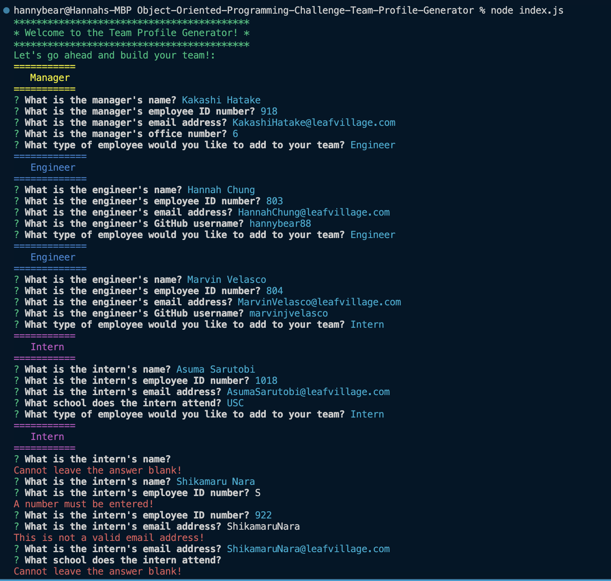
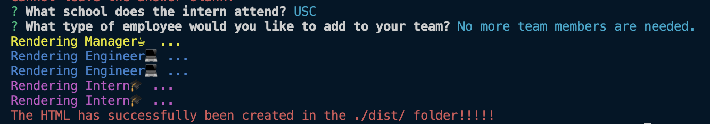
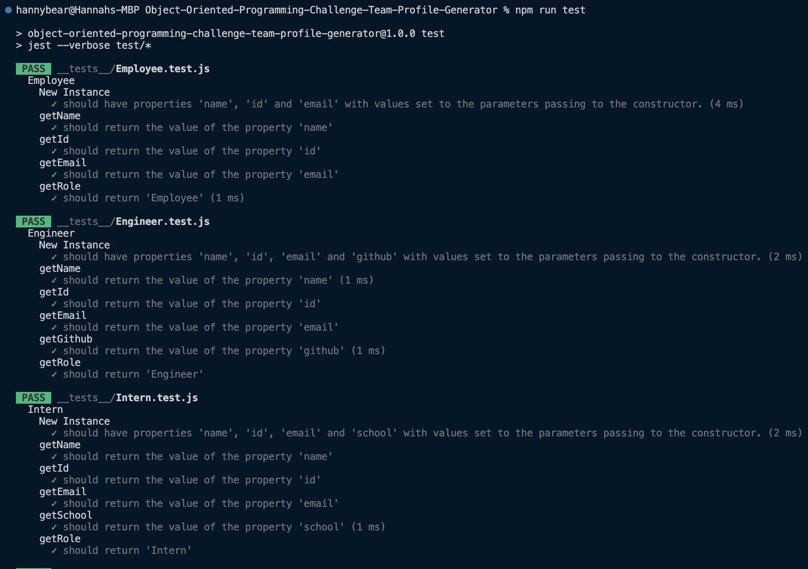
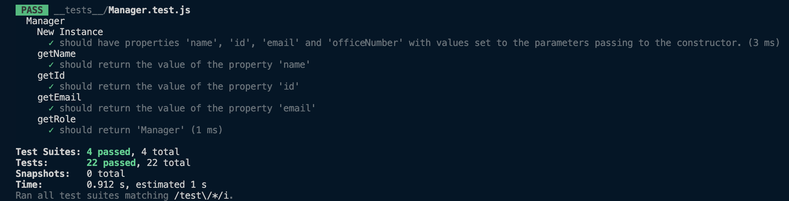
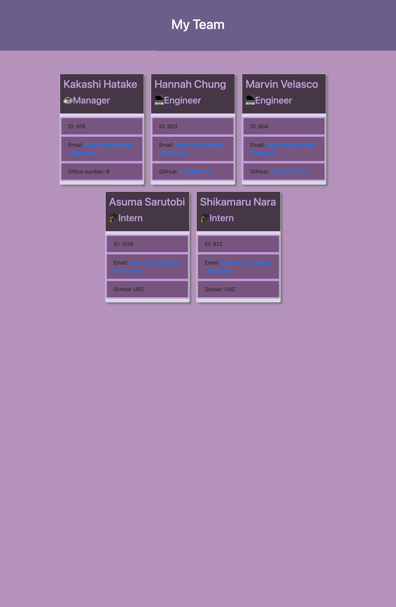

# Object-Oriented-Programming-Challenge-Team-Profile-Generator
HW CHALLENGE #10

## Description
For this assignment, it was focused on Object Oriented Programming and unit testing. For this project we had to build a Node.js command-line application that takes in information about a software engineering team and with that information generates an HTML webpage based on a user's input. Per a requirement we had to make use of Constructors and Class to create the employee objects. These classes includes: Employee, Manager, Engineers, and Interns. This was a fun yet challenging assignment. We also were required to make sure that the all the tests passed which they did. As we get further into the course, the material is getting more and more challenging. I enjoyed building the application and putting my own style to it and making it look different from the demo. My motivation for this assignment is to continue to improve on my knowledge with web development. 

## Table of Contents
* [Installation](#installation)
* [Usage](#usage) 
* [User Story](#userstory)
* [How to Use This Project and Acceptance Criteria](#HowtoUseThisProjectandAcceptanceCriteria)
* [Challenges](#Challenges)
* [Success](#Success) 
* [Demo](#Demo)
* [Support](#Support)
* [Credits](#Credits)
* [Contributors](#Contributors)

## Installation

To install necessary dependencies, run the following command:
```
npm install
```
## Usage
IF you would like to use this application, open the command-line, make sure you are in the directory you want to be in, once you are in that directory run the command "node index.js", answer the following questions prompted to you, be sure to enter required fields and select from optional additional fields when available, once you have completed the prompt then the team.html will be generated that displays a nicely formatted team roster based on user input in the ./dist folder.

## User Story
- AS A manager
- I WANT to generate a webpage that displays my team's basic info
- SO THAT I have quick access to their emails and GitHub profiles


## How to Use This Project and Acceptance Criteria

- GIVEN a command-line application that accepts user input
- WHEN I am prompted for my team members and their information
- THEN an HTML file is generated that displays a nicely formatted team roster based on user input
- WHEN I click on an email address in the HTML
- THEN my default email program opens and populates the TO field of the email with the address
- WHEN I click on the GitHub username
- THEN that GitHub profile opens in a new tab
- WHEN I start the application
- THEN I am prompted to enter the team manager’s name, employee ID, email address, and office number
- WHEN I enter the team manager’s name, employee ID, email address, and office number
- THEN I am presented with a menu with the option to add an engineer or an intern or to finish building my team
- WHEN I select the engineer option
- THEN I am prompted to enter the engineer’s name, ID, email, and GitHub username, and I am taken back to the menu
- WHEN I select the intern option
- THEN I am prompted to enter the intern’s name, ID, email, and school, and I am taken back to the menu
- WHEN I decide to finish building my team
- THEN I exit the application, and the HTML is generated

## Challenges
The challenges I came across was figuring out why I was getting error messages when trying to get my app work. I was also having issues having all the jest tests to pass. After awhile I was able to figure out what the issues were and got it work. I also realized I had started off my code incorrectly on how the app starts. I had it start off with a list of choices instead of startign off with the questions for the manager. Again, after awhile I had the app running correctly. 


## Success
Even though it was challenging, I had successfully had all the jest tests to pass and successfully had the app run. 


## Demo 

Walkthrough Video

Please [click here](https://youtu.be/3wZgLDKN3d8) for a walkthrough video that demonstrates its functionality and all of its tests passing.

Screenshots

Sample Prompts and Answers Screenshot 
 


All Tests Passed Screenshot
 


Sample Generated HTML Screenshot


## Support
If you need support or have any questions about the repo, please [open an issue](https://github.com/hannybear88/Node.js-Challenge-Professional-README-Generator/issues) or contact me via email at hannahkchung88@gmail.com. You can find more of my work on my GitHub, [hannybear88](https://github.com/hannybear88/).


## Credits
Hannah Chung


## Contributors 
Code by Hannah Chung

